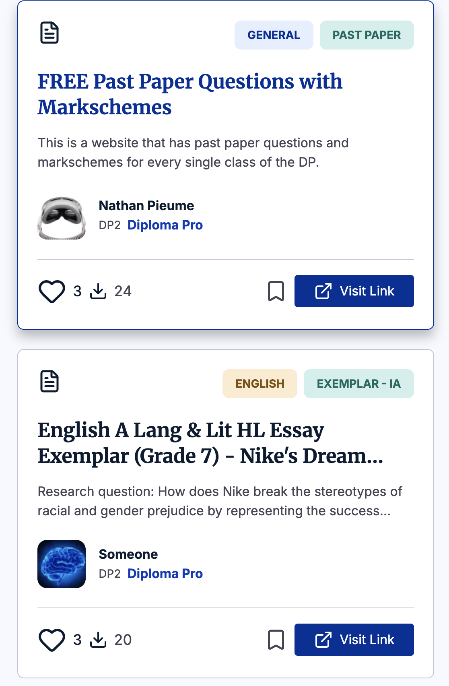
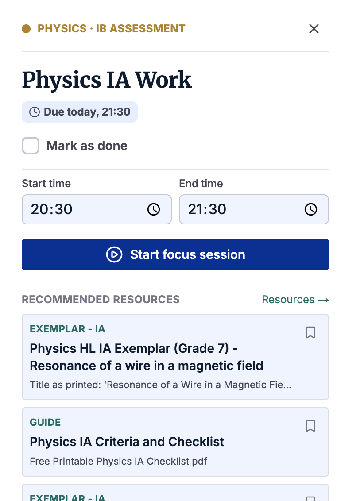

# DiplomaHub

**Everything you need for the IB Diploma, in one place.**

DiplomaHub is a free platform for International Baccalaureate (IB) Diploma students. It combines a library of student-shared resources with a personal planner built around the IB's deadlines and workload.

🔗 **Live:** [www.diplomahub.org](https://www.diplomahub.org)

<p align="center">
  
  
</p>

---

## Why I built it

IB students spend a lot of time hunting for good exemplars and guides scattered across Discord servers, Google Drives and old forum threads, and then juggling IAs, the Extended Essay, TOK and university deadlines across six subjects at once. DiplomaHub puts both halves in one place: find what you need, then plan when you'll use it.

## Features

### Resources
- Student-uploaded exemplars (IA / EE / TOK), templates, guides, notes and past papers
- Each resource can carry a file, an external link, or both
- Filter by subject, type and year, with keyword search ("IA Chemistry" matches "Chemistry IA Template")
- Likes, saves, comments and download tracking
- A **community trust score** per resource, blending the author's reputation with real engagement (see [Engineering highlights](#engineering-highlights))

### 🗓️ The Hub (personal IB planner)
- Weekly drag-and-resize calendar plus a month view
- Milestones bar for IAs, EE, TOK and university deadlines, filterable by subject
- Pomodoro focus timer with a full-screen focus mode
- "Today's Focus" strip and a study-time log
- **Calendar sync**: a private `.ics` feed you can subscribe to from Google/Apple Calendar
- **Calendar import**: upload an `.ics` file (timezones and recurring events handled), with a preview step and one-click undo
- 23 built-in IB subjects plus your own custom subjects, capped at a real DP course load (6 + TOK/EE/CAS)
- Each task shows recommended resources for its subject
- **Works fully without an account**: guest data lives in the browser and is migrated into your account when you sign in
- Animated onboarding tour that spotlights each part of the page

### Articles, profiles & community
- Long-form articles with a rich-text editor (Tiptap), drafts and cover images
- Public profiles, points, a site-wide leaderboard and an automatic "Diploma Pro" tier
- In-app notifications for likes, comments and download milestones
- Public, database-driven product roadmap and a feedback form

### Admin panel
- Analytics dashboard: active users, signups, content trends, Hub adoption and retention (hand-built SVG charts, no chart library)
- User management, content moderation, feedback inbox and roadmap editor

---

## Tech stack

| Layer | Tools |
|---|---|
| Framework | Next.js 16 (App Router, Turbopack), React 19, TypeScript |
| Styling | Tailwind CSS 4 with a custom design-token system |
| Backend | Supabase (Postgres, Auth, Storage) with row-level security |
| Editor | Tiptap v3, server-side `sanitize-html` |
| Calendar | `ical-generator` (export), `ical.js` (import) |
| Infra | Vercel, Upstash Redis (rate limiting), Sentry (error tracking), Resend (email) |
| CI | GitHub Actions: type-check + lint on every push |

---

## Engineering highlights

Some of the more interesting problems I ran into and how I solved them:

**Cutting serverless CPU on Vercel's free tier.** As the user base roughly doubled, the site kept hitting its monthly CPU limit. Instead of guessing, I used Vercel's per-route data to find the real causes:
- Every page load was verifying the user's session with Supabase twice. I switched to local JWT verification in the middleware and passed the verified user id to the rest of the app through a request header. The middleware always strips that header from incoming requests, so it can't be forged.
- A notification bell was polling every 30 seconds in every open tab. It now pauses in hidden or full-screen tabs and polls less often.
- The homepage was rendered from scratch for every visitor. It's now a statically cached page, and the middleware rewrites signed-in users to a separate dynamic dashboard at the same URL.
- I also cached shared queries, turned 16 parallel queries into one, and fixed a hidden prefetch that rendered the planner on almost every page view.

**A trust score that went the wrong way.** Resource trust uses Bayesian shrinkage: a new resource starts at its author's reputation and moves toward its own engagement score as likes and downloads add confidence. I found that this made the score visibly *drop* as downloads came in whenever engagement was below the author's prior. I fixed it so engagement can only raise a resource above its author's baseline.

**Guest mode that migrates cleanly.** The whole planner works with zero database calls for logged-out users. Guest data uses the exact same row shape as the database, so on sign-in it's moved over with idempotent upserts. This means a refresh or a second tab can never duplicate items.

**Calendar import edge cases.** Two real bugs here:
- All-day events shifted back a day because the parsing library silently used the server's local timezone. I rewrote the date math to be timezone-independent.
- Re-importing a calendar failed because Postgres can't use a *partial* unique index for an upsert's conflict check. Replacing it with a regular unique index fixed it.

**Uploads larger than the platform limit.** File uploads were failing because Vercel caps serverless request bodies at ~4.5 MB. Files now go straight from the browser to storage, with validation shared between the client and the server.

**Security.**
- Row-level security and column-level grants in Postgres
- Server-side validation on every form
- File-type allowlists that force the stored content type
- Escaping for user content in emails and structured data
- Rate limiting and a Content Security Policy

---

## Getting started

### Prerequisites
- Node.js 20+
- A Supabase project (Postgres, Auth and Storage)

### Setup

```bash
git clone https://github.com/nathancoolusername/DiplomaHub.git
cd DiplomaHub
npm install
```

Create a `.env.local` file in the project root:

```bash
# Supabase
NEXT_PUBLIC_SUPABASE_URL=
NEXT_PUBLIC_SUPABASE_ANON_KEY=
SUPABASE_SERVICE_ROLE_KEY=

# Optional: each feature is disabled when its variable is unset
UPSTASH_REDIS_REST_URL=
UPSTASH_REDIS_REST_TOKEN=
NEXT_PUBLIC_SENTRY_DSN=
RESEND_API_KEY=
```

Then run:

```bash
npm run dev        # start the dev server on http://localhost:3000
npm run typecheck  # tsc --noEmit
npm run lint       # eslint
npm run build      # production build
```

> **Note:** the database schema is currently managed directly in Supabase, and migration files aren't in the repo yet.

---

## Project structure

```
app/
  (routes)            resources, articles, hub, dashboard, profile, leaderboard, roadmap, admin, ...
  api/calendar/       private .ics calendar feed
  lib/
    actions/          server actions (all return a typed ActionResult)
    supabase/         session, public (cacheable) and service-role clients
    ics.ts            calendar export
    ics-import.ts     calendar import (pure module, no framework imports)
    validation.ts     shared server-side input validation
    ratelimit.ts      Upstash rate limiting
components/
  hub/                planner UI, onboarding tour, focus mode
  home/               signed-out homepage and signed-in dashboard
  admin/              admin tables and SVG charts
proxy.ts              middleware: session verification, homepage rewrite, activity tracking
```

---

## How it's built

DiplomaHub is developed with AI pair-programming (Claude Code). I own the product and engineering decisions: what to build, the architecture, diagnosing problems from production data, and reviewing and testing every change before it ships.

---

Built and maintained by **Nathan** (founder & CTO)

Feedback and bug reports are welcome via [diplomahub.org/feedback](https://www.diplomahub.org/feedback) or info@diplomahub.org.

## License

© 2026 Nathan Pieume. All rights reserved. The code is public for viewing only. See [LICENSE](LICENSE).
